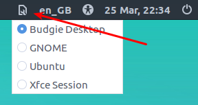

## Index

* [1. MinimalCD install of Xubuntu 16.04](#1-minimalcd-install-of-xubuntu-1604)
   * [1.1 Creating a bootable USB flash drive](#11-creating-a-bootable-usb-flash-drive)
   * [1.2 Installation](#12-installation)
* [2. SSH and configuration](#2-ssh-and-configuration)
   * [2.1. Connecting to your HTPC through SSH](#21-connecting-to-your-htpc-through-ssh)
   * [2.2 Creating a user with limited priviledges](#22-creating-a-user-with-limited-priviledges)
   * [2.3. Adding PPAs and programs](#23-adding-ppas-and-programs)
   * [2.4. Installing a web browser](#24-installing-a-web-browser)
   * [2.5. Creating a Kodi Openbox session](#25-creating-a-kodi-openbox-session)
   * [2.6. Setting up auto login](#26-setting-up-auto-login)
   * [2.7. Adding a Kodi splash screen](#27-adding-a-kodi-splash-screen)
   * [Rebooting and applying changes](#rebooting-and-applying-changes)
* [3. Gluing Kodi and Lutris together](#3-gluing-kodi-and-lutris-together)
   * [3.1. Installing the Lutris Kodi add-on](#31-installing-the-lutris-kodi-add-on)
   * [3.2. Configuring Lutris](#32-configuring-lutris)
* [Additional information](#additional-information)
* [Lisence](#lisence)

Created by [gh-md-toc](https://github.com/ekalinin/github-markdown-toc)

## 1. MinimalCD install of Xubuntu 16.04

### 1.1 Creating a bootable USB flash drive

I will assume for the rest of this guide that you have a understanding of basic [Linux terminal commands](http://www.comptechdoc.org/os/linux/usersguide/linux_ugbasics.html) and [SSH](https://en.wikipedia.org/wiki/Secure_Shell). If these two words are entirely new to you, read these two articles before beginning: [Connecting via SSH to your server](https://mediatemple.net/community/products/dv/204403684/connecting-via-ssh-to-your-server) and [Common SSH commands](https://mediatemple.net/community/products/dv/204643550/common-ssh-commands).

The first thing you should do is to install the minimal Xubuntu 16.04 [ISO](https://en.wikipedia.org/wiki/ISO_image) image on your HTPC. Download the [Ubuntu 16.04 LTS MinimalCD ISO image](https://help.ubuntu.com/community/Installation/MinimalCD) for your architecture (most likely 64-bit if you are running on modern hardware). You need to download it to a different computer from the one you wish to install it to.

To install the ISO image on your HTPC, you need to create a bootable USB flash drive containing the image you just downloaded. There are many programs available which you could use for creating a bootable USB flash drive, but one that is cross-platform and well regarded is [UNetBootIn](https://unetbootin.github.io/). If you have never created and booted from a USB flash drive before you should have a look at the [Ubuntu documentation](https://help.ubuntu.com/community/Installation/FromUSBStick) on how to do this.

Before booting you HTPC from the USB flash drive, make sure that it is connected to the Internet by a wired connection, as the MinimalCD image downloads the packages and programs it needs during installation.

### 1.2 Installation

Installing the MinimalCD image is straight forward, but it looks intimidating since it is not done through a fancy GUI. If you screw up it is not a problem. Simply turn of your HTPC and start the installation process from the beginning.

Many of the steps shown below are copied and modified from the forum thread [Automated XBMC minimal installer v0.93 for Ubuntu 12.04 > 14.04](http://forum.kodi.tv/showthread.php?tid=189241&pid=1653111#pid1653111) by Hack_kid which in turn is based on a guide written by bram77.

1. Connect a keyboard and a mouse to your HTPC. Make sure your HTPC is turned off. 
2. Take the USB flash drive containing the ISO image you created earlier and insert it into one of your HTPC’s USB slots; power it on.
3. In most cases no BIOS adjustments are required and your HTPC will automatically boot from the USB flash drive. If it didn’t, you need to [specify in BIOS](https://www.lifewire.com/how-to-enter-bios-2624481) that you want to boot from the USB flash drive. Most computers also have an option to press a specific key at boot time (usually labeled “Boot order”) which will bring up a dialogue where you can select the USB flash drive as your boot option.
4. Unetbootin will display a screen where you can choose different ways to start the MinimalCD installation. Choose “Install” or “Default” on this screen.
5. Choose your preferred installation language, preferably English because that’s the language I’ll be using in this in this guide. You’ll be able to choose your preferred language for Kodi in Kodi’s settings later on.
6. Choose the country you reside in (For me it’s “Other” → “Europe” → “Norway”).
7. Choose your preferred [locale](https://en.wikipedia.org/wiki/Locale_(computer_software)). Your choice will determine the number format, time format, date format and other minor settings for this installation. I selected “Norway”. The best option for you might be the one that’s pre-selected.
8. In “Configure the keyboard” select “No” and manually choose the keyboard type you use (“Norwegian (eliminate dead keys)” in my case)
9. The installer will automatically configure you [DHCP](https://en.wikipedia.org/wiki/Dynamic_Host_Configuration_Protocol) settings. After this has succeeded you’ll have a working network connection.
10. Enter the HTPC’s [hostname](https://en.wikipedia.org/wiki/Hostname) (I used “htpc”). Make sure there are no other computers with the same hostname on your [LAN](https://en.wikipedia.org/wiki/Local_area_network). Make a note of the hostname you selected, you’ll need this later on in the guide.
11. Confirm the next two screens with Enter (Ubuntu repositories mirror, default is OK).
12. If you use a proxy server, please enter the proper configuration in the related screen. Otherwise skip this option by pressing Enter.
13. The installer will now retrieve the necessary packages from the mirror site. Once it’s done, it will prompt you to reformat your hard drive. I assume that you are going to use the whole hard drive, so in this case, select “Guided – use entire disk”. If not, you can select “Manual” and configure the partitioning accordingly. I won’t go into details here.
14. Enter your preferred username for the administrator account (I used “admin”) and a strong password. This user will hereafter be referred to as ADMIN (whenever you see ADMIN in this guide, substitute ADMIN with the username you selected in this step). However, Kodi and all programs associated with it will be run by a user with limited privileges which you’ll create later.
15. In the next screen the installer will ask you if you want to encrypt the home directory of the user you just created, select “No”. It is very important that you select “No”, if you select “Yes” automatic login into Kodi won’t work.
16. When prompted on how you want the security update to be done, select “Install Security Updates Automatically”.
17. The next screen is an important one. This is where choose what to install on your HTPC. When prompted to install software select the following: “Minimal Xubuntu desktop” and “SSH server”. Select software with Space, confirm with Enter.
18. The last thing you’ll install is the [GRUB boot loader](https://en.wikipedia.org/wiki/GNU_GRUB). Select “Yes” if this is the only OS running in the machine and the GRUB boot loader does not interfere with any other boot loaders.
19. When the installation is complete, remove the USB flash drive from the HTPC and reboot. You should now be greeted by a login screen.

## 2. SSH and configuration

### 2.1. Connecting to your HTPC through SSH

To be able to connect over SSH to the HTPC you have to use a [terminal emulator](https://en.wikipedia.org/wiki/Terminal_emulator). In Linux you can press Ctrl+Alt+T to bring up a terminal. In macOS go to “Applications” → “Utilities” → “Terminal”.

Paste the command below into the terminal application (you have to use Ctrl+Shift+V to be able to paste). It is important that you replace ADMIN and HOSTNAME in the terminal command with the username and hostname you selected during installation.

```sh
ssh ADMIN@HOSTNAME
```

If you are connecting through a computer running Windows, download [PuTTY](http://www.putty.org/) and follow this [guide](https://mediatemple.net/community/products/dv/204404604/using-ssh-in-putty-).

You will now be prompted to trust the connection, then enter your password. Note that you will not see your cursor moving, or any characters, when typing your password.

When you have made a successful connection to the HTPC you should see a terminal prompt looking like the one below. ADMIN will be replaced by your username and HOSTNAME with the HTPC’s hostname. 

```sh
ADMIN@HOSTNAME:~$
```

### 2.2 Creating a user with limited priviledges

Kodi and Lutris will be run by a user with limited privileges. The reason for this is security since this user will have no password and will login automatically. The limited user will have restricted access to the OS (e.g. installing programs system wide or change security settings).

To create a limited user account with a disabled password use the command below. Remember to replace USER with the username you’d like for the limited user account (I used “htpc”). From now on replace USER with the username of the limited user account.

```sh
sudo adduser --disabled-password --gecos "" USER
```

When prompted for a password, enter the ADMIN password you selected during installation.

You also have to assign some privileges to the newly created user. Remember to replace USER in the command below.

```sh
sudo usermod -a -G cdrom,video,plugdev,users,input,netdev,fuse USER
```

This command gives the limited user user access to the CD-ROM (cdrom), video devices (video), connected external devices (plugdev), controller and joystick input (input), connected wireless and ethernet networks (netdev) and mounted user-space filesystems (fuse).

### 2.3. Adding PPAs and programs

The minimal Xubuntu desktop ships with Kodi 15.2 available in its [repositories](https://en.wikipedia.org/wiki/Software_repository). However, by adding the [Kodi Stable PPA](https://launchpad.net/~team-xbmc/+archive/ubuntu/ppa) it is possible to get the latest stable version.

First, add the PPA with the command below.

```sh
sudo apt-add-repository ppa:team-xbmc/ppa
```

Press Enter when prompted.

Lutris is not included in Xubuntu 16.04 by default, therefore you need to add the Lutris PPA to be able to download it. Please note that each line in the command box below must be entered as a separately.

```sh
ver=$(lsb_release -sr); if [ $ver != "16.10" -a $ver != "17.04" -a $ver != "16.04" ]; then ver=16.04; fi

wget -q http://download.opensuse.org/repositories/home:/strycore/xUbuntu_$ver/Release.key -O- | sudo apt-key add -

echo "deb http://download.opensuse.org/repositories/home:/strycore/xUbuntu_$ver/ ./" | sudo tee /etc/apt/sources.list.d/lutris.list
```

To be able to install Steam you must enable the [Multiverse repository](https://help.ubuntu.com/community/Repositories#Multiverse).

```sh
sudo add-apt-repository multiverse
```

Now, update the package lists.

```sh
sudo apt-get update
```

Install the programs. This command will install Kodi, the Kodi driver for joysticks and gamepads, Lutris, Steam and any dependencies they require.

```sh
sudo apt-get install kodi kodi-peripheral-joystick lutris steam
```

Press Y when prompted.

Also, at this point, it is a good idea to check for any general updates.

```sh
sudo apt-get dist-upgrade
```

### 2.4. Installing a web browser

You should also install a web browser, as it is not included by default with the minimal Xubuntu install. I installed [Midori](https://en.wikipedia.org/wiki/Midori_(web_browser)), which is a lightweight and fast web browser. However, you might prefer Firefox or [Chromium](https://en.wikipedia.org/wiki/Chromium_(web_browser)) (the open source version of Chrome). Only use one of the commands below (you do not need three browsers).

To install Midori:

```sh
sudo apt-get install midori
```

To install Firefox:

```sh
sudo apt-get install firefox
```

To install Chromium:

```sh
sudo apt-get install chromium-browser
```

### 2.5. Creating a Kodi Openbox session

There are several guides on the Internet and on the [Kodi Community Forum](http://forum.kodi.tv/) which explain how to create a separate login session for Kodi to run in. These usually involve a lot of scripting and editing of [init files](https://en.wikipedia.org/wiki/Init). The easiest solution I have found is to download and use [kodi-openbox](https://github.com/lufinkey/kodi-openbox) created by lufinkey. This is a collection of scripts that includes an [Openbox](https://en.wikipedia.org/wiki/Openbox) session that runs Kodi and a script that will launch external programs and manage their windows.

To install kodi-openbox, download the latest .zip file from the GitHub master branch using the command below.

````sh
cd ~/

wget -O kodi-openbox-master.zip https://github.com/lufinkey/kodi-openbox/archive/master.zip
````

Extract the .zip file.

```sh
unzip kodi-openbox-master.zip
```

If you get a prompt telling you are missing the package unzip, install it using the command below, then repeat the command above.

```sh
sudo apt-get install unzip
```

Move into the extracted directory, create a [.deb package](https://en.wikipedia.org/wiki/Deb_(file_format)) from the extracted content and then install the .deb.

```sh
cd kodi-openbox-master

./build.sh

sudo dpkg -i kodi-openbox.deb
```

If you get a warning that you have unmet dependencies (most likely), enter this command.

```sh
sudo apt-get -f install
```

Then remove the files you downloaded and extracted.

```sh
cd ~/

sudo rm -r kodi-openbox-master kodi-openbox-master.zip
```

### 2.6. Setting up auto login

When the HTPC is powered on it should automatically log in USER into the Kodi Openbox session. To accomplish this you need to configure [LightDM](https://en.wikipedia.org/wiki/LightDM), the login manager used by Xubuntu 16.04.

To do so, you need to edit LightDM’s configuration file. The file will be created automatically by the command below if it doesn’t already exist.

```sh
sudo nano /etc/lightdm/lightdm.conf
```

Paste in the following configuration. Make sure that you replace USER with the limited account’s username.
```sh
[Seat:*]
autologin-user=USER
autologin-session=kodi-openbox
```

Save the file by pressing Ctrl+X and then press Enter.

### 2.7. Adding a Kodi splash screen

If you want to get rid of the default Xubuntu splash screen during boot, it is possible to change it to a Kodi one. I have set up a [repository](https://github.com/solbero/plymouth-theme-kodi-animated-logo) containing [Kodibuntu’s](http://kodi.wiki/view/Kodibuntu) animated logo splash screen and adapted it for Ubuntu 16.04 and later versions.

To install plymouth-theme-kodi-animated-logo, download the latest .zip file from the GitHub master branch using the command below.

```sh
cd ~/

wget -O plymouth-theme-kodi-animated-logo-master.zip https://github.com/solbero/plymouth-theme-kodi-animated-logo/archive/master.zip
```

Extract the .zip file.

```sh
unzip plymouth-theme-kodi-animated-logo-master.zip 
```

Move into the extracted directory, create a .deb package from the extracted content and install the .deb.

```sh
cd plymouth-theme-kodi-animated-logo-master

./build.sh

sudo dpkg -i plymouth-theme-kodi-animated-logo.deb
```

Remove the files you downloaded.

```sh
cd ~/

sudo rm -r plymouth-theme-kodi-animated-logo plymouth-theme-kodi-animated-logo.zip
```

### Rebooting and applying changes

Reboot the HTPC to apply all the changes you have made since part 2.1.

```sh
sudo reboot
```

Congratulations, if everything went well, you should now have automatically launched Kodi in the Kodi Openbox session.

## 3. Gluing Kodi and Lutris together

### 3.1. Installing the Lutris Kodi add-on

In this last section you’ll install the Lutris Kodi Add-on which will display the games organized by Lutris in Kodi.

Since you restarted your HTPC at the end of the last section, you will have lost your remote SSH connection. To connect to your HTPC over SSH again follow the instructions in 2.1.

When you are connected, paste the command below which will change your remote user from ADMIN to USER.

```sh
sudo su - USER
```

The terminal prompt should now look like this.

```sh
USER@HOSTNAME:~$
```

Now you need to download the [Lutris Kodi add-on](https://github.com/RobLoach/script.lutris) created by RobLoach. Instead of installing the add-on through SuperRepo as described on the add-on’s GitHub page, you’ll install it manually through the terminal.

```sh
cd ~/

wget -O script.lutris-master.zip https://github.com/RobLoach/script.lutris/archive/master.zip

unzip script.lutris-master.zip

mkdir ~/.kodi/addons/script.lutris

cp -r script.lutris-master/* .kodi/addons/script.lutris/
```

You also need to tell the Kodi Lutris add-on the path to the `lutris` executable. Instead of doing this through the add-on, you can edit the addon’s `settings.xml` with [sed](https://en.wikipedia.org/wiki/Sed).

```sh
sed -i "s#value=\"lutris\"#value=\"/usr/bin/lutris\"#" .kodi/addons/script.lutris/resources/settings.xml
```

Remove the files you downloaded.

```sh
cd ~/

rm -r script.lutris-master script.lutris-master.zip
```

The add-on will be located in Kodi at “Add-ons” → “Program Add-ons” → “Lutris”. 

To log out of the remote SSH connection, enter this command.

```sh
exit
```

Most Kodi skins, except the default skin Estuary, support [custom home menu items](http://kodi.wiki/view/Custom_home_items). I have added Lutris as a custom home menu item in the skin I’m using. Consult the documentation for skin you plan on using if this is possible.

### 3.2. Configuring Lutris

Configuration and installation of games of Lutris, Steam and other game providers such as Itch and GOG cannot be done through Kodi. To do so you need to log into a Xubuntu session. To do so go to “Power” in the main menu of Kodi and select “Exit” in the dialogue. This will log you out of the Kodi and the Kodi Openbox session.

You should now see the LightDM login screen. Before you log in as USER, you need to select the session you want to log into. In the upper right-hand corner of the login screen there is a session icon you can click which will show you a drop-down list of the available sessions. Click the icon and select “Xubuntu Session”. Then log in as USER.



To get back to the Kodi Openbox session later you can either restart your HTPC or log out of your current session, select the Kodi Openbox session from the drop-down and log in as USER.

You should now see a very minimal Xubuntu desktop. The small Xubuntu icon in the upper left-hand corner is the application menu. Click on it, find Lutris and open the program.

I would strongly suggest that you create an account on lutris.net before you add any games to Lutris. 

> Like Steam or Desura, Lutris has two parts: a website and a client application, which communicate. On the website, you can browse the supported games, add them to your personal library and start their installation by clicking on the Install link for the version of the game you possess (if someone bothered to make an installer for it). Granted that you have installed the client software, it will open the game installation window, leading you through the steps to finalize the game’s setup. Once it’s done, you will be able to launch the game directly or close the installation window and the game will be present in your local library the next time you start Lutris.

To create an account click on “Lutris” → “Register account” in Lutris. The page [lutris.net/user/register/](https://lutris.net/user/register/) should upen up in the web browser you installed earlier. After you have created a Lutris account, you can link your Steam account to it if you like.

> To import your Steam library, go to your Lutris profile and click the “Sign in through Steam” button. You will then be redirected to Steam and will be asked to login. This steps associates your Steam account with your Lutris account. This procedure does not grant Lutris any rights on your Steam account, the only info we get from this is your Steam account identifier. Your Steam account has to be public in order for the library sync to work, if you like it private, you can make it public before the import and switch it back when completed.

After you have created an account go to “Lutris” → “Connect” to link the client with the website. If you linked your Steam account, all your Steam games should be automatically added to Lutris.

You could also tell Lutris to search for newly installed games from local game sources at startup. To do so go to “Lutris” → “Import” and switch the toggle next to the game source from “Off” to “On“. At the moment Steam, Steam for Windows, Desktop Games and ScummVM is supported.

To install games you can use automatic installer scripts. Go to [lutris.net/games/](https://lutris.net/games/) and search for the game you wish to install. Make sure that you use an installer script written for Linux, or WINE if installing a Windows game in Linux. All games you install with the automatic scripts will be installed to `~/Games/`, except for Steam games which are installed to `~/.steam/`.

If there is no installer script for the game you wish to install you can add it manually to Lutris. You need to have installed the game before hand.

> You also have the ability to manually add games to the client, from the “Game” → “Add” menu or from the toolbar button. The Add Game window will let you enter the game’s name, pick the runner [[1\]](https://lutris.net/about/#about-runners) (more runners can be installed from the runners management window, available from “Lutris” → “Manage runners”), browse for the main executable/ROM and enter other necessary details before saving.

To keep everything organized, I have installed all my non-Steam games in individual folders in the folder `~/Games`.

When you have installed your games and added them to Lutris it is time to test everything out. Log out of the Xubuntu session, select the Kodi Openbox session from the drop-down in LightDM and log in as USER.

Navigate to the Lutris add-on in Kodi and play a game!

## Additional information

This section is not a part of the main guide. I have included it so that those familiar with Linux can get some more information on customizing this HTPC setup. I will mostly provide link to guides and other web pages.

* If your controller is not automatically detected by Kodi, you might have [configure it](http://kodi.wiki/view/HOW-TO:Configure_controllers).
* Gamepads which work out of the box on Linux are, but not limited to, the Sony DualShock 3, DualShock 4 and Sixaxis; Steam Controller; Microsoft Xbox 360; Logitech F310, F510, F710 and gamepads made by 8Bitdo.
* I’m using [MoltenGamepad](https://github.com/jgeumlek/MoltenGamepad) as an abstraction layer for all my controllers. It makes games agnostic to what controller I’m actually using.
* You can use [AntiMicro](https://github.com/AntiMicro/antimicro) and custom game launch scripts to make a controller simulate a mouse and keyboard in games which doesn’t support controllers.
* I have installed the lastest stable [MESA](https://en.wikipedia.org/wiki/Mesa_(computer_graphics)) provided from the [“Ubuntu-X” team PPA](https://launchpad.net/~ubuntu-x-swat/+archive/ubuntu/updates) since I’m running on Intel Integrated Graphics. I recommend you install this PPA if you are running on Intel or AMD graphics hardware.
* If you are running Nvidia hardware, you can install the latest stable and long-lived branches of the Nvidia closed source driver from the [Proprietary GPU Drivers PPA](https://launchpad.net/~graphics-drivers/+archive/ubuntu/ppa). 
* You can [autostart](http://openbox.org/wiki/Help:Autostart) programs and commands when the Kodi Openbox session is launched. You can do this by adding the relevant commands to `/.config/openbox/autostart`. You might have to create the file since it doesn’t exist by default.
* You can also autostart programs and commands when Kodi is started, terminated or killed in the Kodi Openbox session. You can do this by adding the relevant commands to `~/.kodi-openbox/onstart`, `~/.kodi-openbox/onfinish` or `~/.kodi-openbox/onkill`.
* Lutris (v0.4.9) currently supports the following runners: Linux (Native games), Steam, Web, WINE, WINE + Steam, Libretro, DOSBox, MAME, MESS, ScummVM, ResidualVM, Adventure Game Studio, Mednafen, FS-UAE, Vice, Stella, Atari800, Hatari, Virtual Jaguar, Snes9x, Mupen64Plus, Dolphin, PCSX-Reloaded, PCSX2, PPSSPP, Osmose, Reicast, Frotz, jzIntv, O2EM, ZDoom, Citra, DeSmuME and DGen.