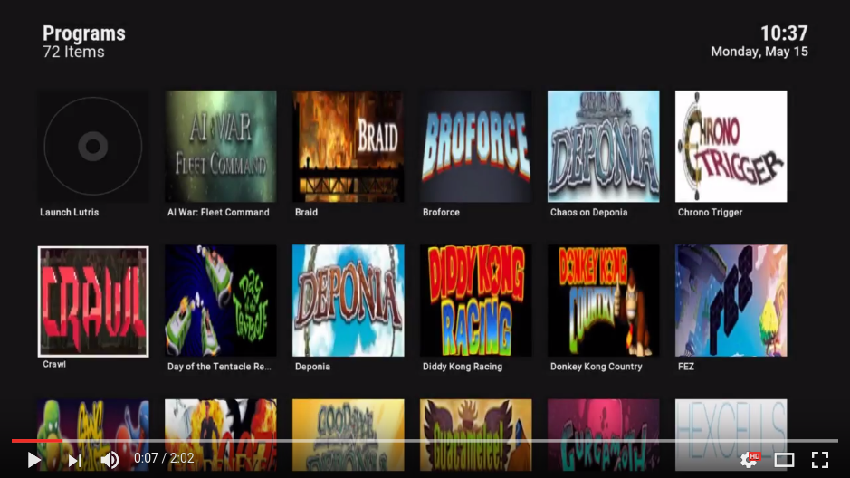

# Guide: Making a gaming home theater PC with Kodi and Lutris

**This guide will explain how to set up [Kodi](https://en.wikipedia.org/wiki/Kodi_\(software\)) and [Lutris](https://lutris.net/) on a [HTPC](https://en.wikipedia.org/wiki/Home_theater_PC). The goal is to create a fast, light-weight media and gaming system in the same vein as [SteamOS](https://en.wikipedia.org/wiki/SteamOS), but with Kodi as the interface.**

The guide itself is a separate file which you can find [HERE](./GUIDE.md).

I have earlier created another guide titled [Minimal Ubuntu 16.04 with Kodi, Steam & EmulationStation](http://forum.kodi.tv/showthread.php?tid=282593) where I tried to achieve something similar. However, I never felt that the approach described in that guide was satisfactory. It relied on launching Steam and/or [EmulationStation](http://www.emulationstation.org/) as separate applications outside of Kodi for playing games.

Using Lutris, however, it is possible to create a much more coherent media center and gaming experience.

> Lutris is an open source gaming platform for GNU/Linux. It allows you to gather and manage (install, configure and launch) all your games acquired from any source, in a single interface.

All games will be organized natively in Kodi and no external applications are ever launched, except the games you want to play!

The guide is written with the Linux beginner in mind. Therefore, I have added a lot of links to external resources where you can read up on the different topics covered in the guide. If anything seems unclear, you need some help, or notice a mistake in the guide, please let me know using one of the channels below.

## Discussion

You can discuss this guide on:

* **Kodi Community Forum** — [You can discuss and ask for help here](http://forum.kodi.tv/showthread.php?tid=314656)
* **GitHub** — [You can log issues here](https://github.com/solbero/guide-kodi-lutris/issues)

## Demo

## Lisence

This work is licensed under a Creative Commons Attribution 4.0 International License.