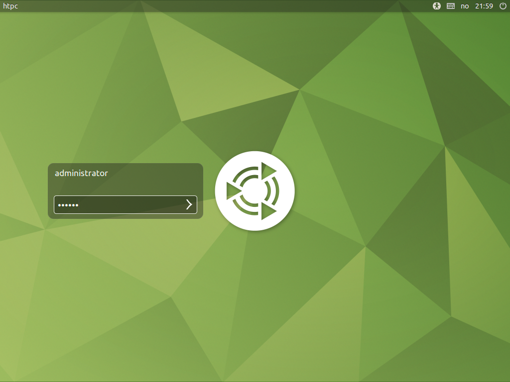
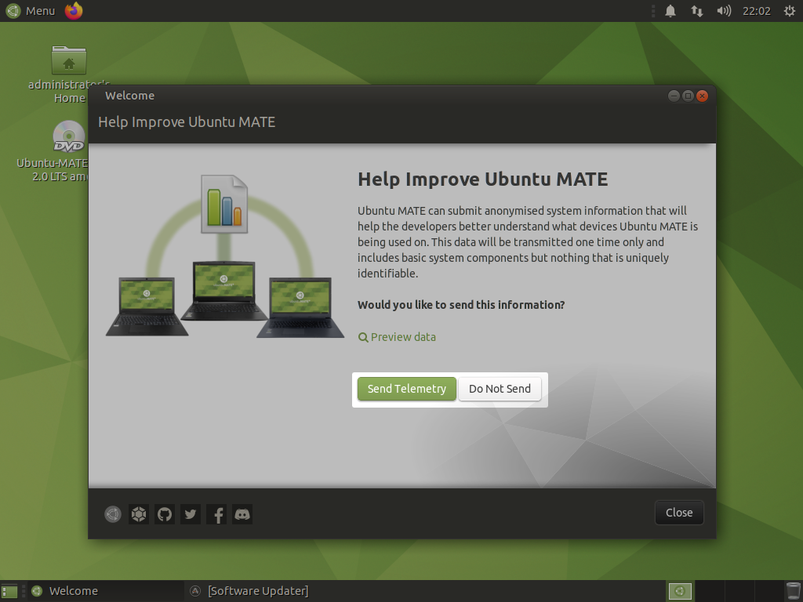
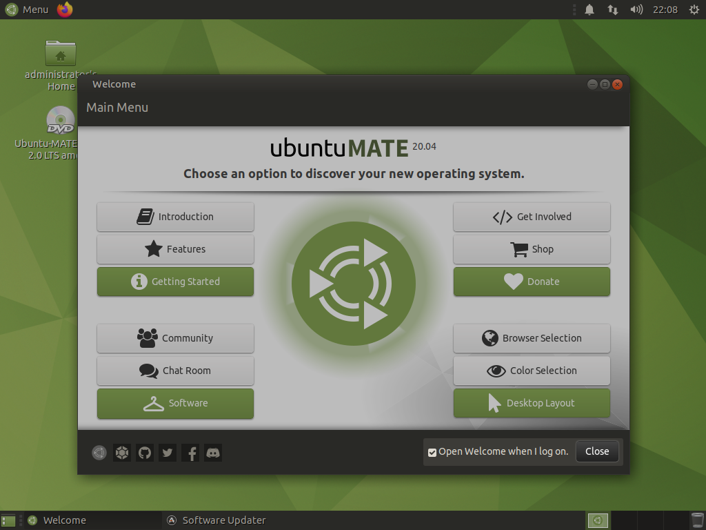
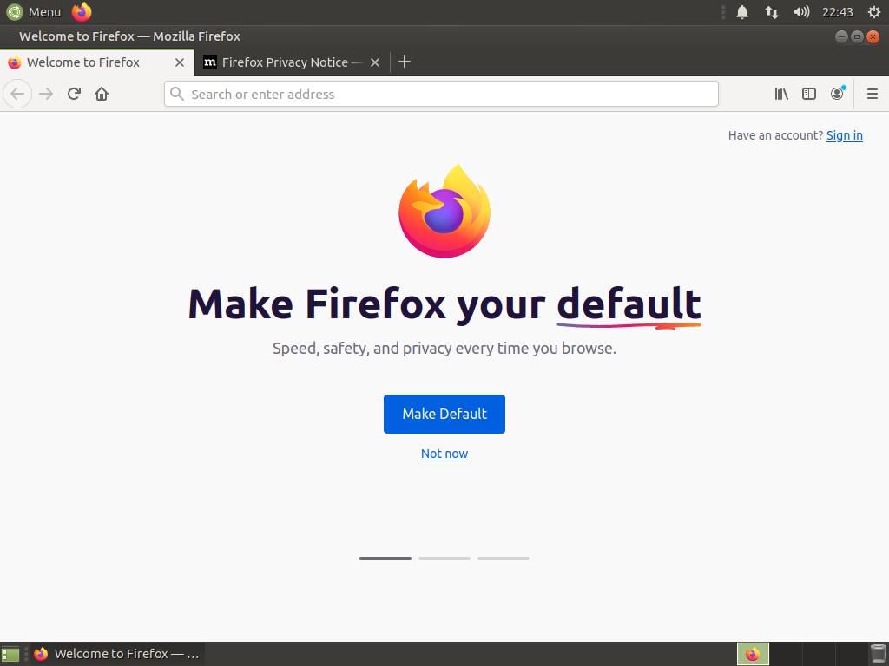
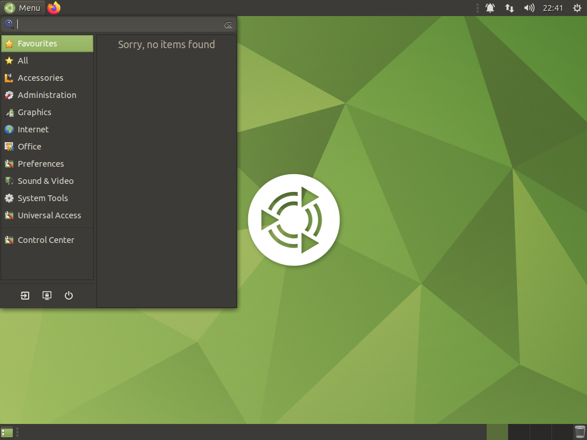
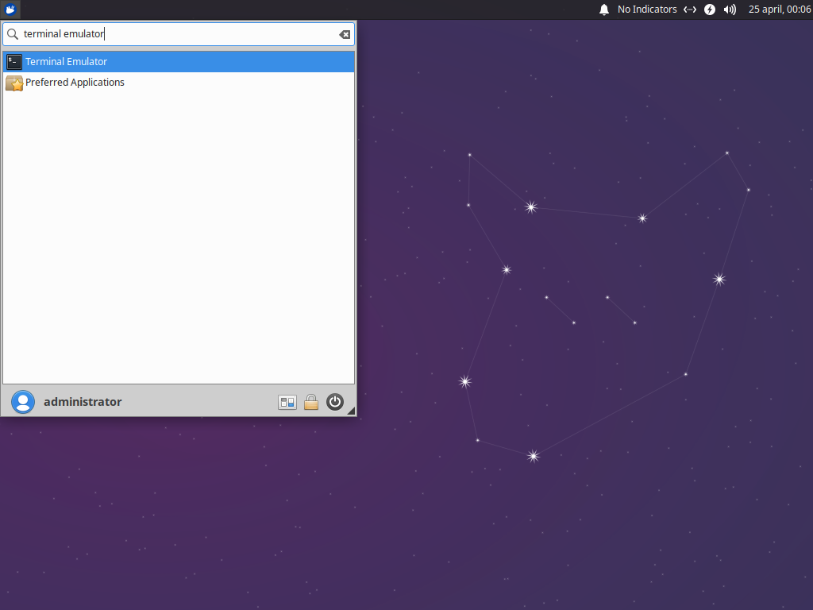
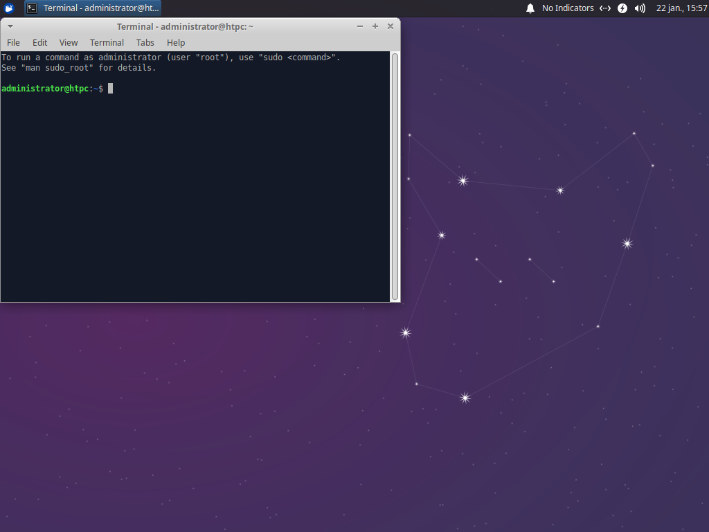

# Desktop

## Log in

Log in by entering the password you created earlier in the password field and then press ++enter++.

[{: .center}](./img/desktop/login.png)

You are met by a welcome greeter. The greeter asks you if you want to send the Ubuntu MATE developers an anonymised system information report generated during install.

!!! info "Why are the developers asking for a system report?"
    The developers use the data from the submitted reports to better understand what devices Ubuntu MATE is being used on.

Click either **Send Telemetry** or **Do Not Send** according to your preference.

[{: .center}](./img/desktop/telemetry.png)

On the next page of the greeter uncheck the checkbox next to **Open Welcome when I log on** and then click **Close**.

[{: .center}](./img/desktop/greeter.png)

## Open a browser

Click the small, orange Firefox logo in the top-left corner of the desktop to open the web browser.

[{: .center}](./img/desktop/browser.png)

### Open a terminal emulator

Click the small, blue Xubuntu logo in the top-left corner of the desktop to open the application menu.

[{: .center}](./img/desktop/application-menu.png)

Type **terminal emulator** in the search box and press ++enter++.

[{: .center}](./img/programs/terminal-emulator.png)

This opens a [terminal emulator](https://en.wikipedia.org/wiki/Terminal_emulator).

[{: .center}](./img/programs/terminal.png)

--8<-- "docs/abbreviations.md"