# Installation

## Select a distribution

What [Linux distribution](https://en.wikipedia.org/wiki/Linux_distribution) should install on your HTPC as the operating system? As of 2020 there are over 500 Linux distributions in active development and selecting one that fits your use case can be a hard undertaking. Frequently switching distributions even has its own term, *distro-hopping*. 

In this guide I have chosen to use the distribution [Ubuntu MATE](https://ubuntu-mate.org/about/). During the installation of Ubuntu MATE you will configure it as a minimal desktop. This means that all the programs of the full desktop version will not be installed. This gives you a light-weight and bloat-free installation on which to build the HTPC setup.

To install Ubuntu MATE you need to create a [bootable USB flash drive](https://en.wikipedia.org/wiki/USB_flash_drive#Booting_operating_systems) and use it to install Ubuntu MATE on the HTPC.

## Create a bootable flash drive
Start by downloading the [Ubuntu MATE 20.04 ISO](https://ubuntu-mate.org/download/amd64/focal/) image to a computer other than the one you plan on using as the HTPC.

On this computer, [download the UNetBootIn installer](https://unetbootin.github.io/) and install it.

!!! info "Software for flashing a USB drive"
    There are many programs available which you could use to create a bootable USB flash drive. I have used [UNetBootIn](https://en.wikipedia.org/wiki/UNetbootin) in this guide since it is cross-platform and well regarded.

Insert a USB flash drive of at least 2 GB capacity into a USB port on the computer.

!!! warning
    All the content on the USB flash drive will be lost when you create the bootable USB flash drive. So make sure there is nothing important on it you would like to keep.

Launch UNetBootIn, select the **Disk image** option by pressing the radio button and supply the program with the ISO you downloaded earlier by clicking ***…***. Then click **OK** to create the bootable USB flash drive.

[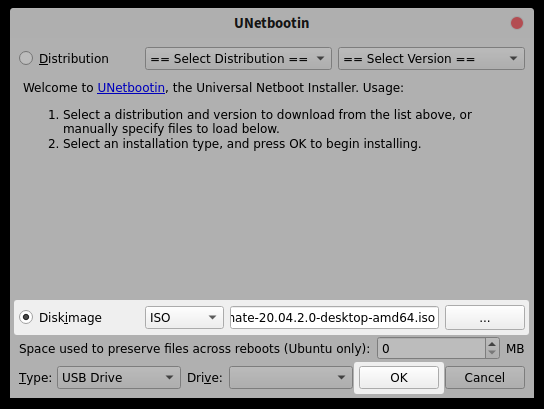{: .center}](./img/installation/unetbootin.png)

## Install the Linux distribution

Installing Ubuntu MATE is quite straightforward since it has a GUI which guides you through the installation steps.

### Preparations

Connect a monitor, a keyboard, a mouse and an ethernet cable to the computer you plan on using as the HTPC. Make sure the computer is powered off. Take the USB flash drive containing the bootable ISO image you created earlier and insert it into one of the computer’s USB slots and power it on.

### Boot order

In most cases no BIOS adjustment is required and your computer automatically boots from the USB flash drive. If it didn’t, you need to specify in BIOS that you want to boot from the USB flash drive. With most computers you have to press a specific key at boot time, usually ++f12++, to bring up a dialog where you can select the USB flash drive as your boot option.

### Language, keyboard, updates and installation type

When booting from the USB flash drive, UNetBootIn displays a menu with several install options. Choose **Install Ubuntu MATE** from the list and press ++enter++.

[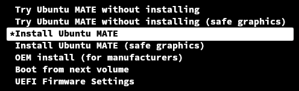{: .center}](./img/installation/boot-menu.png)

The Ubuntu MATE installer now starts. From the provided list select the language for this installation, preferably **English** because that is the language I am using in this guide. Click **Install Ubuntu MATE** to proceed.

[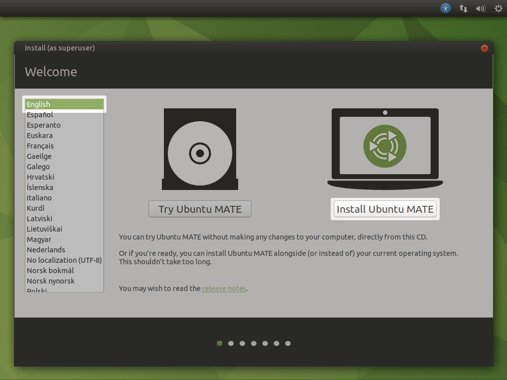{: .center}](./img/installation/language.png)

Now you have to select your keyboard layout from the list provided by the installer. In the picture below I have selected **Norwegian/Norwegian** because my keyboard layout is Norwegian. Click **Continue** to proceed.

[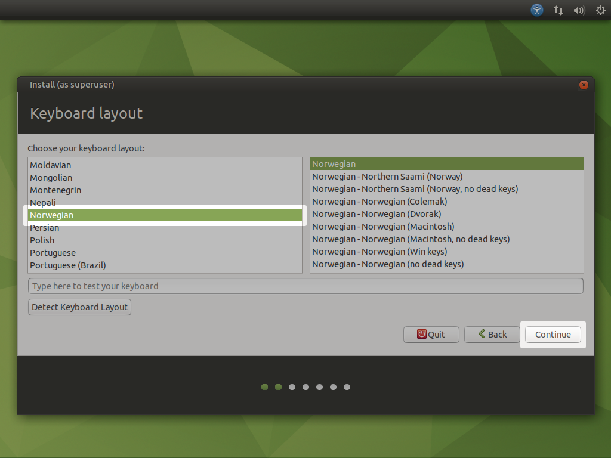{: .center}](./img/installation/keyboard.png)

The installer now asks you if you want to create a normal or minimal installation. Select **Minimal installation** as your choice. Also, make sure the checkboxes next to  **Download updates while installing Ubuntu MATE** and  **Install third-party software for graphics and Wi-Fi hardware and additional media formats** are checked. Click **Continue** to proceed.

[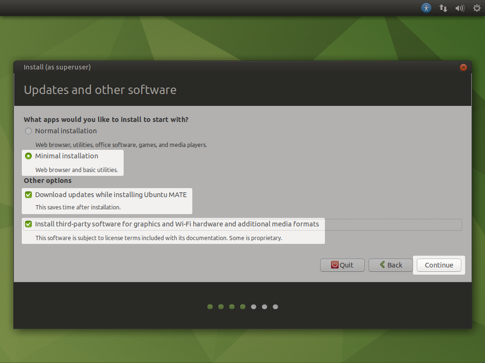{: .center}](./img/installation/updates.png)

Now you have to select an installation type. Keep the default choice **Erase disk and install Ubuntu MATE**. When you click **Install Now** the installer asks you to confirm your choice.

!!! warning
    All the content on the hard drive used for the installation will be lost when you click **Install Now**. So make sure there is nothing important on it you would like to keep.

[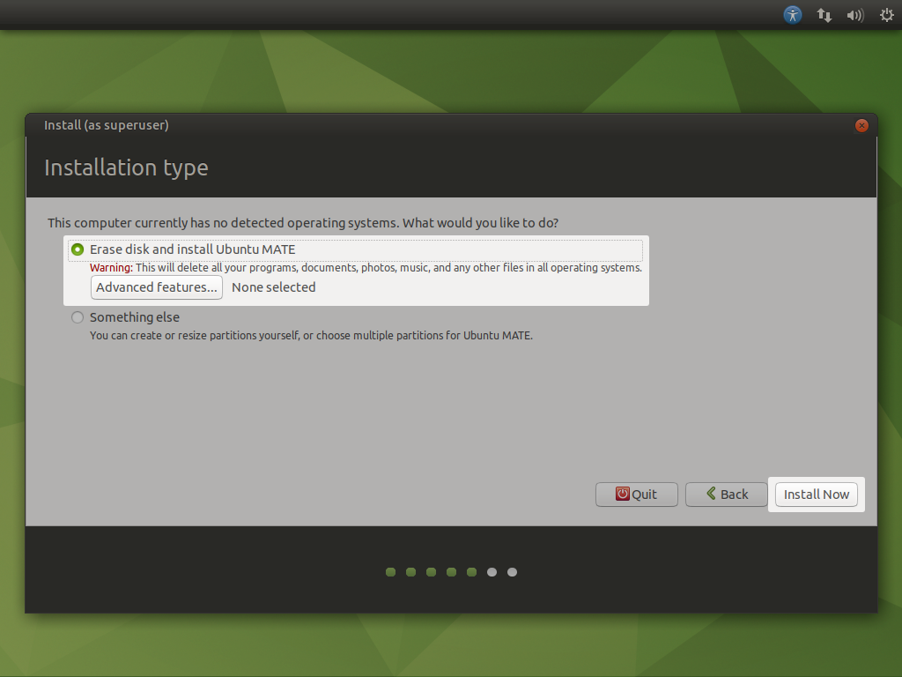{: .center}](./img/installation/type.png)

### Location, username and password

The installation is now underway, but there are a few steps left.

Select your approximate location by clicking on the map. This determines the time-zone and [locale](https://en.wikipedia.org/wiki/Locale_(computer_software)) used for this installation. I have selected **Oslo/Norway** in the picture below because that is where I live. Click **Continue** to proceed.

[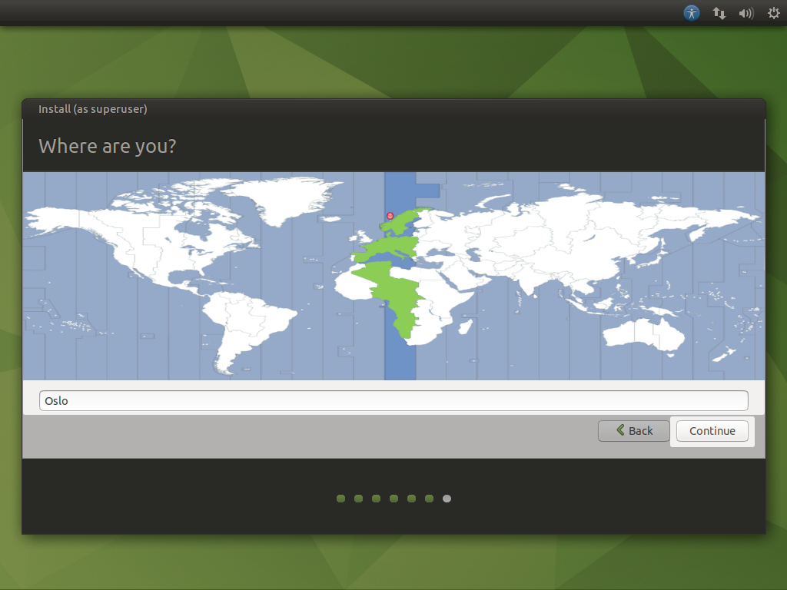{: .center}](./img/installation/location.png)

You are now asked to enter a username, a hostname and enter a strong password. I used *administrator* as the full name and username, *htpc* as the hostname, and entered a strong password. Click **Continue** to proceed.

[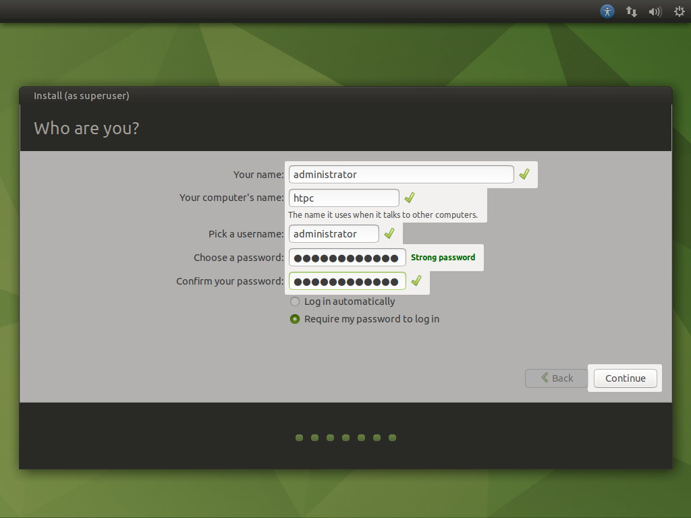{: .center}](./img/installation/username-and-password.png)

The installer will now finish the installation of Ubuntu MATE.

[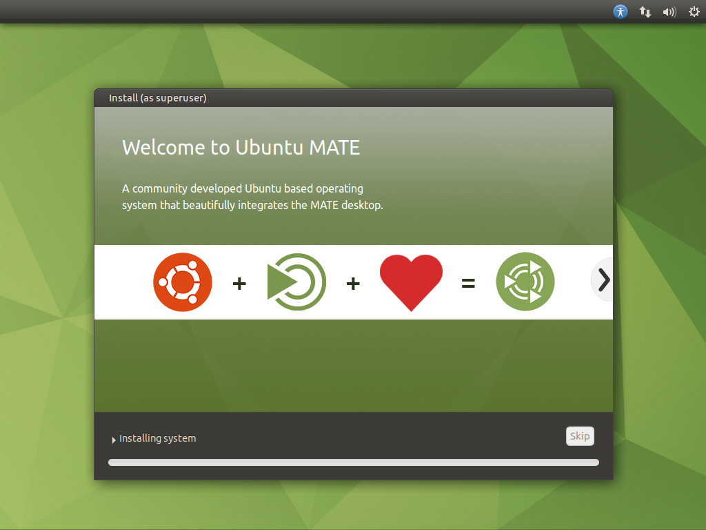{: .center}](./img/installation/installing.png)

### Rebooting

When the installation is complete, you are prompted to perform a restart. Click **Restart Now** to restart the HTPC.

[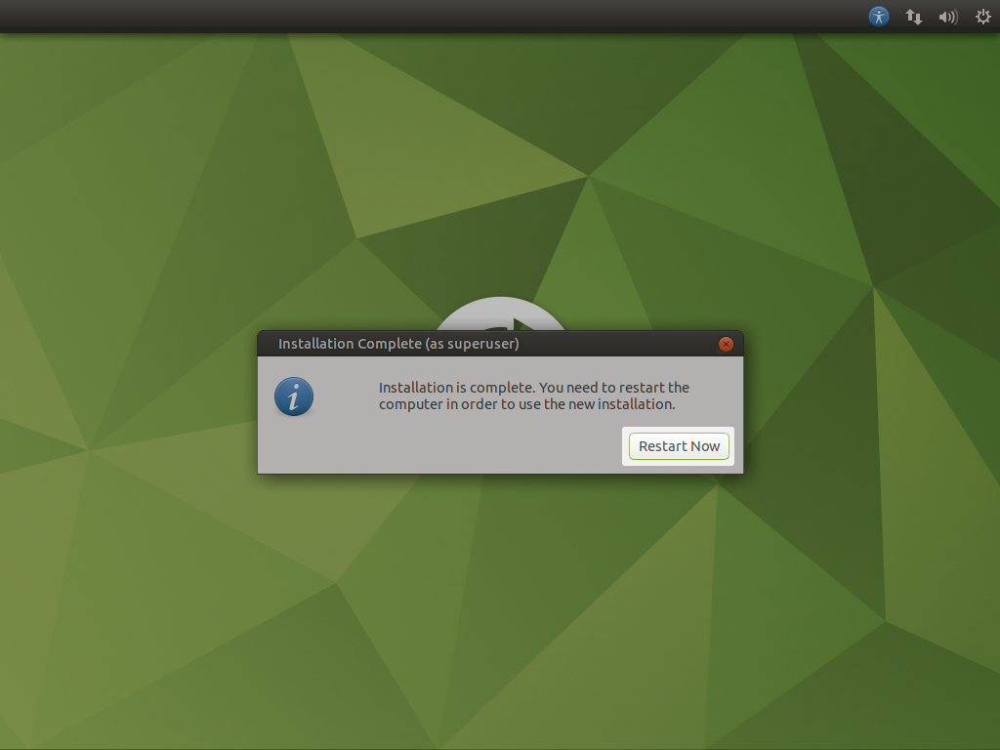{: .center}](./img/installation/restart.png)

You are prompted to remove the USB flash drive, then press ++enter++ to complete the restart.

[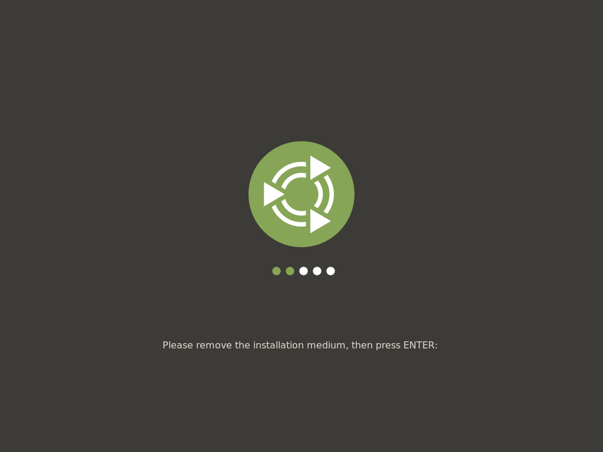{: .center}](./img/installation/remove-usb.png)

After the reboot, you are greeted by a login screen.

[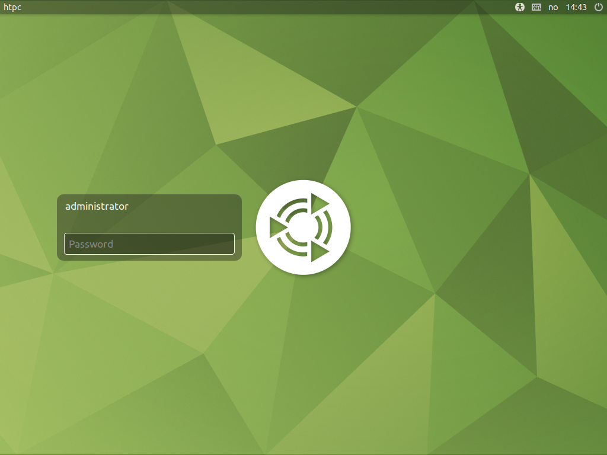{: .center}](./img/installation/login-screen.png)

--8<-- "docs/abbreviations.md"