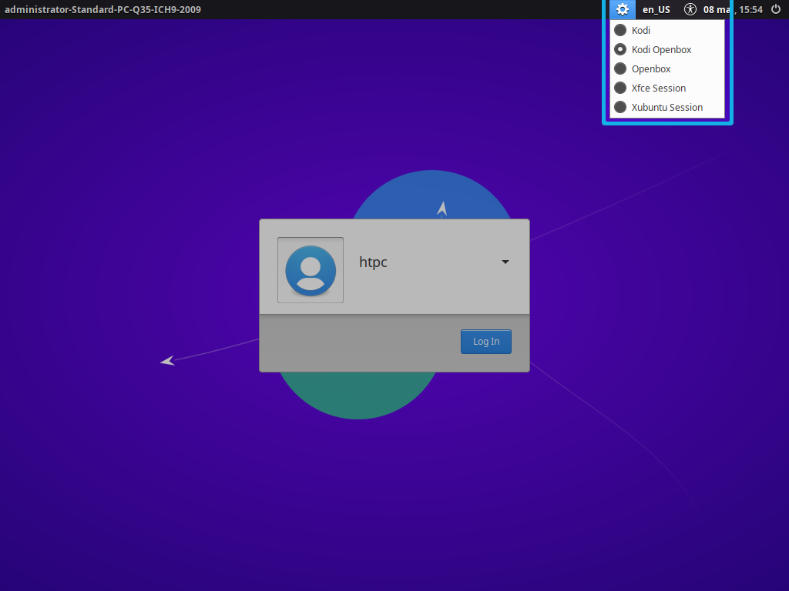
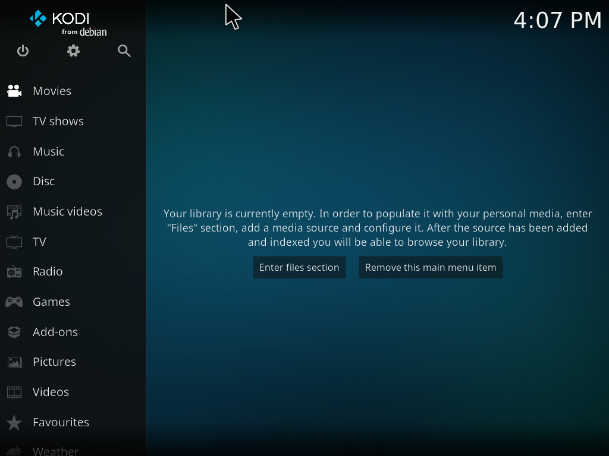
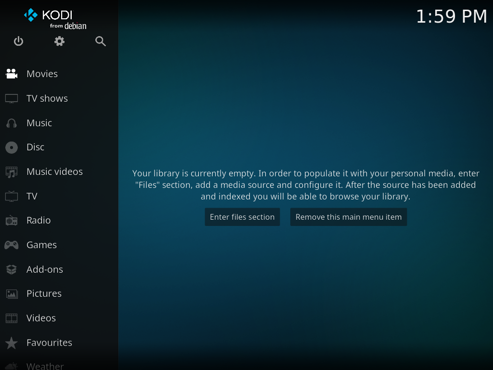
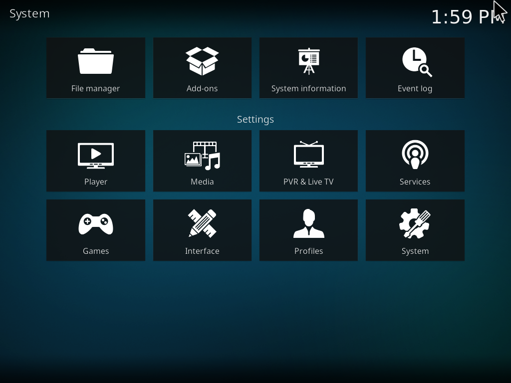
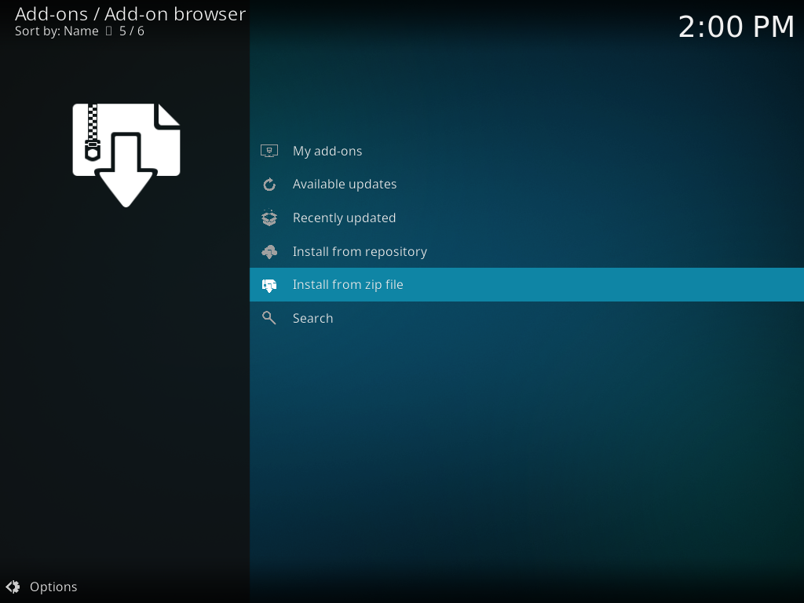

# Lutris and Kodi

## Downloading the Lutris Kodi add-on

Now you need to download the [Lutris Kodi add-on](https://github.com/RobLoach/script.lutris) created by RobLoach and myself. This is an add-on for Kodi that enables you to view and launch games through Lutris in Kodi.

The add-on is provided in a Kodi repository. To download it, click the application menu, type `terminal emulator` and open it. Enter the command below to download the repository file for the add-on.

```sh
wget -O repository.solbero.matrix.zip https://github.com/solbero/repository.solbero.matrix/raw/master/repository.solbero.matrix/repository.solbero.matrix.zip
```

## Changing the log in session

Now it is finally time to check out Kodi and the custom login session. To do so you need to log into the `kodi-openbox` session.

Start by logging out of the current session as you did in the previous part. This will bring you to the log in screen.

Click the small Xubuntu icon in the top-left of the screen. This opens a menu where you can select *Kodi Openbox* as the login session and log in.

[{: .center}](./img/lutris-and-kodi/change-session.png)

Congratulations!

[{: .center}](./img/lutris-and-kodi/kodi.png)

## Install a Kodi repository

To install the repository you downloaded earlier navigate you need to go to the *Add-on browser* in Kodi.

Click the gear icon to go to the settings menu.

[{: .center}](./img/lutris-and-kodi/kodi-settings.png)

In the settings menu click *Add-ons* to enter the add-on browser.

[{: .center}](./img/lutris-and-kodi/kodi-addons.png)

In the add-on browser, click on **Install from zip file**.

[{: .center}](./img/lutris-and-kodi/kodi-install-zip.png)

Kodi will now prompt you that installing from unknown sources is disabled for security reason. To enable unknown sources click on the *Settings* button.

To install the repository you have to allow “Unknown Sources” in Kodi. This is not done through the terminal, but through Kodi. To do so, visit “Settings” → “System” → “Add-ons” and make sure it is enabled.

To install the repository, go to “Settings” → “Add-ons” → “Install from zip file”. Navigate to your Home folder where you should see a file named solbero.repository-1.0.1.zip.

Navigate back to the add-ons menu and select “Install from repository”. From there, go to “solbero's Kodi add-ons repository” → “Program add-ons” → “Lutris”. Select and install the add-on.

The add-on will be located in Kodi at “Add-ons” → “Program Add-ons” → “Lutris”.

Afterwards, in the terminal, remove the files you downloaded.

```sh
cd ~/

rm repository.solbero-1.0.1.zip
```

To log out of the remote SSH connection, enter this command.

```sh
exit
```

Most Kodi skins, except the default skin, Estuary, support [custom home menu items](http://kodi.wiki/view/Custom_home_items). I have added the Lutris Kodi Addon as a custom home menu item in the skin I’m using. Consult the documentation for the skin you plan on using to see whether this option is available.

### 3.2. Configuring Lutris

Configuration and installation of games in Lutris, Steam and other game providers such as Itch and GOG cannot be done through Kodi. Instead, you need to log into a Xubuntu session. To do so, go to “Power” in the main menu of Kodi and select “Exit” in the dialog. This will log you out of the Kodi and the Kodi Openbox session.

You should now see the LightDM login screen. Before you log in as $USER, you need to select the session you want to log into. In the upper right-hand corner of the login screen there is a session icon you can click which will show you a drop-down list of the available sessions. Click the icon and select “Xubuntu Session”. Then log in as $USER.


To get back to the Kodi Openbox session later you can either restart your HTPC or log out of your current session, select the Kodi Openbox session from the drop-down and log in as $USER.

You should now see a very minimal Xubuntu desktop. The small Xubuntu icon in the upper left-hand corner is the application menu. Click on it, find Lutris and open the program.

I would strongly suggest that you create an account on lutris.net before you add any games to Lutris.

> Like Steam or Desura, Lutris has two parts: a website and a client application, which communicate. On the website, you can browse the supported games, add them to your personal library and start their installation by clicking on the Install link for the version of the game you possess (if someone bothered to make an installer for it). Granted that you have installed the client software, it will open the game installation window, leading you through the steps to finalize the game’s setup. Once it’s done, you will be able to launch the game directly or close the installation window and the game will be present in your local library the next time you start Lutris.

To create an account click on “Lutris” → “Register account” in Lutris. The page [lutris.net/user/register/](https://lutris.net/user/register/) should open up in the web browser you installed earlier. After you have created a Lutris account, you can link your Steam account to it if you like.

> To import your Steam library, go to your Lutris profile and click the “Sign in through Steam” button. You will then be redirected to Steam and will be asked to login. This steps associates your Steam account with your Lutris account. This procedure does not grant Lutris any rights on your Steam account, the only info we get from this is your Steam account identifier. Your Steam account has to be public in order for the library sync to work, if you like it private, you can make it public before the import and switch it back when completed.

After you have created an account, go to “Lutris” → “Connect” to link the client with the website. If you linked your Steam account, all your Steam games should be automatically added to Lutris.

You could also tell Lutris to search for newly installed games from local game sources at startup. To do so, go to “Lutris” → “Import” and switch the toggle next to the game source from “Off” to “On“. At the moment of writing, Steam, Steam for Windows, Desktop Games and ScummVM are supported.

To install games, you can use automatic installer scripts. Go to [lutris.net/games/](https://lutris.net/games/) and search for the game you wish to install. Make sure that you use an installer script written for the store from which you bought the game, or WINE if installing a Windows game in Linux. All games you install with the automatic scripts will be installed to `~/Games/`, except for Steam games which are installed to `~/.steam/`.

If there is no installer script for the game you wish to install, you can add it manually to Lutris. You need to have installed the game beforehand.

> You also have the ability to manually add games to the client, from the “Game” → “Add” menu or from the toolbar button. The Add Game window will let you enter the game’s name, pick the runner [[1\]](https://lutris.net/about/#about-runners) (more runners can be installed from the runners management window, available from “Lutris” → “Manage runners”), browse for the main executable/ROM and enter other necessary details before saving.

When you have installed your games and added them to Lutris, it is time to test everything out. Log out of the Xubuntu session, select the Kodi Openbox session from the drop-down in LightDM and log in as $USER.

Navigate to the Lutris add-on in Kodi and play a game!