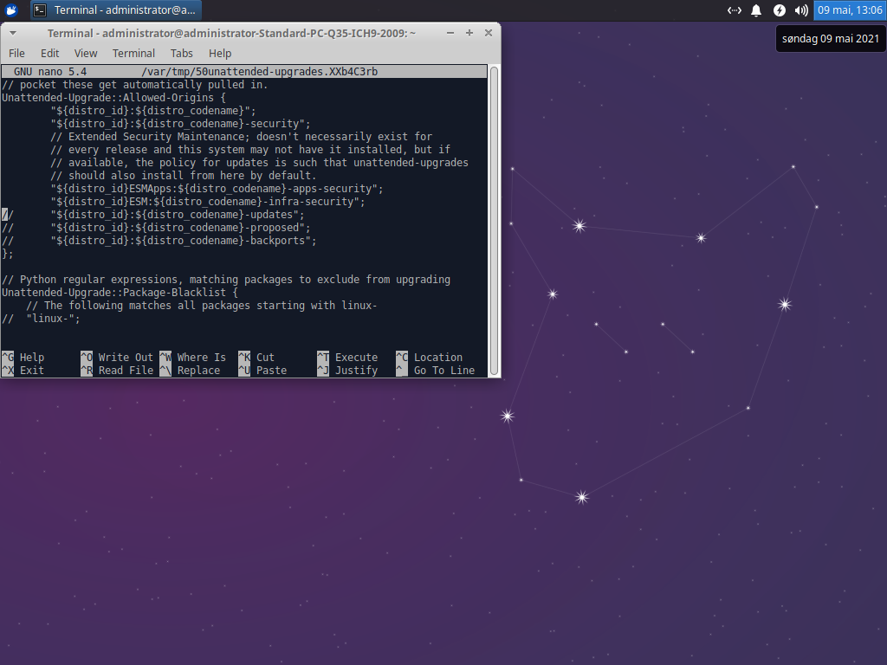

# Programs

## Terminal commands in Linux

Write 

## System updates

### Check for updates

The first thing to do is to check for any system updates. Type or paste the command below into the terminal emulator and press ++enter++ to execute it.

```sh
sudo apt update
```

!!! tip "How to paste into a terminal emulator?"
    Use the keyboard shortcut ++ctrl+shift+c++ to paste. In a terminal emulator the keyboard shortcut ++ctrl+c++ is used to abort the current task.

!!! info "What does the `sudo` command do?"

You will be prompted to enter your administrator password. Even though no characters appear when you type your password, you are actually typing your password. When you are done typing press ++enter++ to confirm your password.

When the `sudo apt update` command is finished, you have to use another command to download any available updates.

```sh
sudo apt full-upgrade
```

After you execute the command above the available updates are displayed in the terminal emulator. Confirm the installation of the updates by pressing ++y++.

### Enable automatic updates

Now you have updated the HTPC, but it is a bit tedious to execute two commands in the terminal emulator every time you want to check for and apply updates.

What we want is for the HTPC to check for and apply updates automatically. To do so you have to use a program named `unattended-upgrades`. This is a program created to keep Linux servers up to date, but it is also perfect for keeping the HTPC up to date.

Now you need to configure what updates are applied automatically. To do so you need to change a configuration file. The command below will open the configuration file in a terminal text editor called [GNU nano](https://en.wikipedia.org/wiki/GNU_nano).

```sh
sudo -e /etc/apt/apt.conf.d/50unattended-upgrades
```

In the text file you will notice that a lot of the lines start with `//`. This means that those lines are commented out and are not used when the system reads the configuration file. You need to remove the comment marks from some lines to enable automatic updates.

[{: .center}](./img/programs/unattended-upgrades.png)

First, remove the comment marks from line 15. By uncommenting this line you will enable automatic updates.

To quickly go to line 15 in *GNU nano* press ++ctrl+shift+-++. When prompted to enter a line number, enter 15 and press ++enter++. Now the cursor should be at the beginning of line 15 which looks like this.

```sh
//      "${distro_id}:${distro_codename}-updates";
```

Remove `//` from the beginning of the line. It should look like this afterwards.

```sh
        "${distro_id}:${distro_codename}-updates";
```

Next, go to line 90 and remove the comment marks and enable it. By uncommenting and setting `false` to `true` you will allow the system to remove unused packages after an update. After editing the line should look like this.

```sh
Unattended-Upgrade::Remove-Unused-Dependencies "true";
```

To save and exit *Gnu nano* press ++ctrl+x++, then ++y++ when prompted, and finally ++enter++ to confirm.

```sh
sudo dpkg-reconfigure --priority=low unattended-upgrades
```

## Install programs

Installing programs in Linux is a little different from other operating systems. Almost all programs are kept in [software repositories](https://en.wikipedia.org/wiki/Software_repository) and these repositories are made up of packages.

Some programs correspond to a single package, but most of the time a program is a collection of packages and dependencies. To be able to know which packages are part of what program and keep track of all their dependencies you must install programs using a [package manager](https://en.wikipedia.org/wiki/Package_manager).

In fact, you just used Xubuntu’s package manager [APT](https://en.wikipedia.org/wiki/APT_(software)) to check for and install system updates.

### Web browser

```sh
sudo apt install xombrero
```

### Kodi

Kodi is included in the default Xubuntu repositories. However, the included version is not the most recent. To install the most recent version add the Kodi stable PPA to the system’s list of repositories.

```sh
sudo add-apt-repository ppa:team-xbmc/ppa

sudo apt update

sudo apt install kodi
```

### Game managers

Lutris is also not included in the default Xubuntu repositories. But instead of downloading the source files and packaging it yourself like you did in the last step, the Lutris organization maintains their own repository. Therefore, to install Lutris all you need to do is add the Lutris [PPA](https://itsfoss.com/ppa-guide/) to the system’s list of repositories.

```sh
sudo add-apt-repository ppa:lutris-team/lutris

sudo apt update

sudo apt install lutris
```

Steam is not required by Lutris, but you need to install it separately if you want play games provided by Steam through Lutris.

```sh
sudo apt install steam
```

### Window manager

Now you need to install [Openbox](https://en.wikipedia.org/wiki/Openbox). It is a standalone, minimalist and light-weight [window manager](https://en.wikipedia.org/wiki/Window_manager).

To install Openbox and its dependencies, enter the command below into the terminal emulator.

```sh
sudo apt install openbox
```

Confirm the installation by pressing ++y++ if prompted.

### Login session

Now you need to install the package [`kodi-openbox`](https://github.com/lufinkey/kodi-openbox). It is a custom [login session](https://en.wikipedia.org/wiki/Login_session) which uses Openbox as its window manager and automatically starts Kodi when you log in.

`kodi-openbox` is not available in the Xubuntu repositories. Therefore, you will have to download the `kodi-openbox` source files from Github, package it yourself and then install it using APT. Use the command below to download the latest source files from GitHub.

```sh
wget -O kodi-openbox-master.zip https://github.com/lufinkey/kodi-openbox/archive/master.zip
```

Use [`unzip`](https://en.wikipedia.org/wiki/Info-ZIP) to extract the .zip file.

```sh
unzip kodi-openbox-master.zip
```

Move into the extracted directory using [`cd`](https://en.wikipedia.org/wiki/Cd_(command)).

```sh
cd kodi-openbox-master
```

Create a [`deb` package](https://en.wikipedia.org/wiki/Deb_\(file_format\)) from the extracted content and then install the package using APT. Notice that each line below is a separate command and must be entered one-by-one into the terminal emulator.

```sh
./build.sh

sudo apt install ./kodi-openbox.deb
```

Finally, remove the files you downloaded and extracted with [`rm`](https://en.wikipedia.org/wiki/Rm_(Unix)).

```sh
cd ..

rm -r kodi-openbox-master*
```

### Custom splash screen

If you want to get rid of the default Xubuntu splash screen during boot, it is possible to change it to a Kodi one. I have set up a [repository](https://github.com/solbero/plymouth-theme-kodi-animated-logo) containing [Kodibuntu’s](http://kodi.wiki/view/Kodibuntu) animated logo splash screen and adapted it for Ubuntu 16.04 and later versions.

To install the plymouth-theme-kodi-animated-logo, download the latest .zip file from GitHub using the command below.

```sh
wget -O plymouth-theme-kodi-animated-logo-master.zip https://github.com/solbero/plymouth-theme-kodi-animated-logo/archive/master.zip
```

Extract the .zip file.

```sh
unzip plymouth-theme-kodi-animated-logo-master.zip
```

Move into the extracted directory, create a .deb package from the extracted content and install the .deb.

```sh
cd plymouth-theme-kodi-animated-logo-master

./build.sh

sudo apt install ./plymouth-theme-kodi-animated-logo.deb
```

Remove the files you downloaded.

```sh
cd ~/

rm -r plymouth-theme-kodi-animated-logo-master*
```

--8<-- "docs/abbreviations.md"