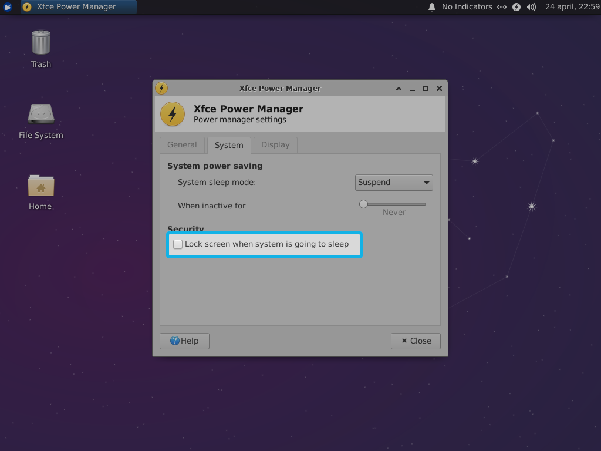

# User account

## Why a new user account?

The user that you will create in this part will automatically log in to the `kodi-openbox` login session without a password. Therefore, it is good security practice to to create a new user to do this and severely limit what this user can do on the system.

### Create a user account

To create a new user account enter the commands below into a terminal emulator. The command `adduser` creates a new user account with the name `htpc`. The command `passwd -d` sets the `htpc` user account as passwordless.

```sh
sudo adduser --disabled-password --gecos "" htpc

sudo passwd -d htpc
```

### Limit privileges

Now you need to give priviledges to the new user account by entering the commands below.

```sh
sudo usermod -a -G cdrom,video,plugdev,users,input,netdev,dialout htpc
```

This command gives the htpc user account access to the CD-ROM (`cdrom`), video devices (`video`), connected external devices (`plugdev`), controller and joystick input (`input`), and connected wireless and Ethernet networks (`netdev`).

### Enable auto login

When the HTPC is turned on, the idea is that the `htpc` user should be automatically logged in to the `kodi-openbox` session. To accomplish this, you need to configure [LightDM](https://en.wikipedia.org/wiki/LightDM), the login manager used by Xubuntu 18.04, to allow the `htpc` user to log in automatically.

You need to edit LightDM’s configuration file. The file will be created automatically by the command below if it doesn’t already exist.

```sh
sudo -e /etc/lightdm/lightdm.conf
```

Paste in the following configuration. You might be warned about pasting the command into the editor.

```sh
[Seat:*]
autologin-user=htpc
autologin-session=kodi-openbox
```

Save the file by pressing ++ctrl+x++ and then press ++enter++.

## Log in as the new user

Now you need to log in as the new user to set up Kodi and Lutris. To do so open the application menu and then click the shutdown icon in the buttom-right corner of the menu.

[{: .center}](./img/user/application-menu2.png)

In the log out dialogue select `Log Out`.

[{: .center}](./img/user/log-out.png)

Now you will see the log in screen. click the small down arrow next to `Administrator` to get a drop down menu.

[{: .center}](./img/user/user-menu.png)


Select `htpc` from the list and click the `Log In` button.

[{: .center}](./img/user/select-user.png)

You will now be logged in as the `htpc` user and are ready to continue to the next step.

## Configure the new user

You need to configure a few things for specifically for the `htpc` account. We need to disable screen blanking, the screensaver and the lock-screen. These features are handy on a laptop, but will be annoying when the computer is used as a HTPC.

### Disable screensaver and lock screen

By default the screensaver will be enabled and the screen locked if the HTPC is idle for 10 minutes or more.

To disable the screen saver and lock screen open the application menu, write `screen saver` and open the program.

[{: .center}](./img/user/screensaver.png)

In the tab `Screensaver`, untoggle `Enable Screensaver`.

[{: .center}](./img/user/screensaver-screensaver.png)

Then click on the tab `Lock Screen` and untoggle `Enable Lock Screen`.

[{: .center}](./img/user/screensaver-lockscreen.png)

### Disable power management

By default the power management will lock the screen if it goes to sleep. Also, it will also blank the screen and go to sleep after 10 minutes and turn it off after 15 minutes.

To disable screen blanking and sleeping open the application menu, write `power management` and open the program.

[{: .center}](./img/user/power-manager.png)

Under `Security`, uncheck `Lock screen when system is going to sleep.

[{: .center}](./img/user/power-manager-system.png)

Click on the tab `Display` and untoggle `Display power management`.

[{: .center}](./img/user/power-manager-display.png)

--8<-- "docs/abbreviations.md"